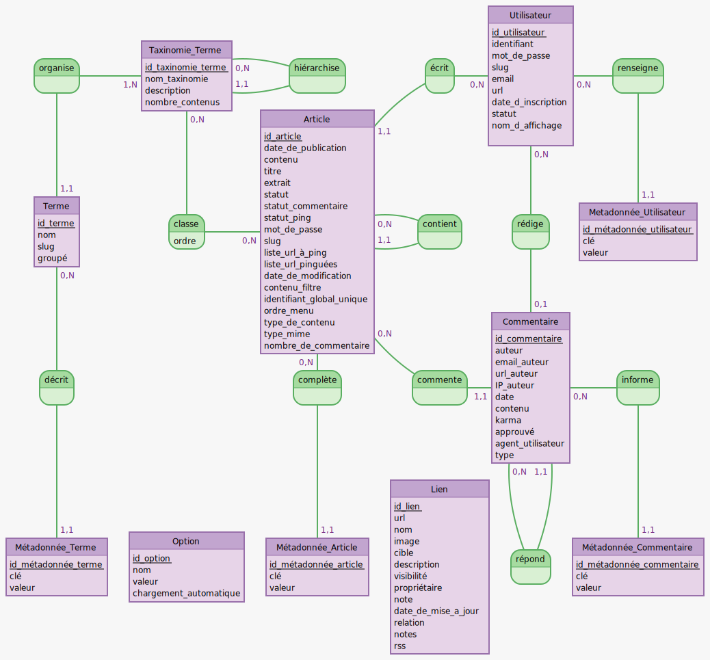

# Gestion des données avec WordPress

## Modèle conceptuel de données (MCD)

### oCooking

### WordPress

[Voir le diagramme EER MySQL](wordpress-eer.png)

---

## Entités

Nom|Table WordPress|Détail(s)
-|-|-

---

## Propriétés (Attributs)

### ?

Propriété|Table WordPress|Colonne|Détail(s)
-|-|-|-

---

## Associations

Entité 1|Nom|Entité 2|Table WordPress|Colonne entité 1|Colonne entité 2|Détail(s)
-|-|-|-|-|-|-

---
